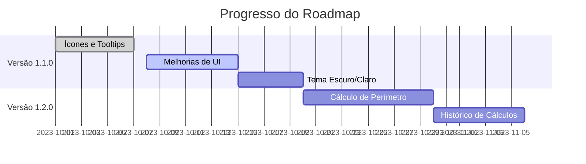

# Roadmap do Projeto Calcula_Area

## 🚦 Versão Atual: 1.0.0 (Básico)

**Funcionalidades implementadas:**
- Cálculo de áreas para quadrados, triângulos e círculos
- Interface gráfica básica com Java Swing
- Validação simples de entrada
- Build básico com NetBeans

## 📅 Próximas Versões

### Versão 1.1.0 (Melhorias de UI/UX) - Previsto para MM/AAAA
- [ ] Adicionar ícones para cada forma geométrica
- [ ] Melhorar responsividade da interface
- [ ] Adicionar tema escuro/claro
- [ ] Tooltips explicativos nos campos

### Versão 1.2.0 (Novas Funcionalidades) - Previsto para MM/AAAA
- [ ] Adicionar cálculo de perímetro
- [ ] Implementar retângulo como nova forma
- [ ] Adicionar histórico de cálculos
- [ ] Exportar resultados para CSV

### Versão 2.0.0 (Grande Atualização) - Previsto para MM/AAAA
- [ ] Internacionalização (i18n) para múltiplos idiomas
- [ ] Sistema de plugins para novas formas geométricas
- [ ] Integração com API de cálculos matemáticos
- [ ] Versão web complementar

## 🔧 Melhorias Técnicas

### Backend
- [ ] Migrar para Java 17 LTS
- [ ] Implementar testes unitários (JUnit 5)
- [ ] Adicionar cobertura de testes (JaCoCo)
- [ ] CI/CD com GitHub Actions

### Frontend
- [ ] Migrar para JavaFX (em estudo)
- [ ] Componentes UI mais modernos
- [ ] Animações de transição

## 🌐 Ecossistema
- [ ] Documentação completa com JavaDoc
- [ ] Wiki do projeto no GitHub
- [ ] Pacote no Homebrew (para MacOS)
- [ ] Build automatizado para Windows (.exe)

## 🤝 Como Contribuir

Quer ajudar a implementar algum item do roadmap?
1. Verifique as [issues abertas](https://github.com/SEU_USUARIO/Calcula_Area/issues)
2. Procure por tags como `good first issue` ou `help wanted`
3. Siga nosso [guia de contribuição](CONTRIBUTING.md)

## 📊 Progresso Atual

## 🔄 Atualizações

Este roadmap é dinâmico e será atualizado regularmente conforme o projeto evolui. Sugestões são bem-vindas!

**Última atualização:** 22/06/2025